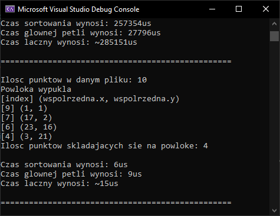
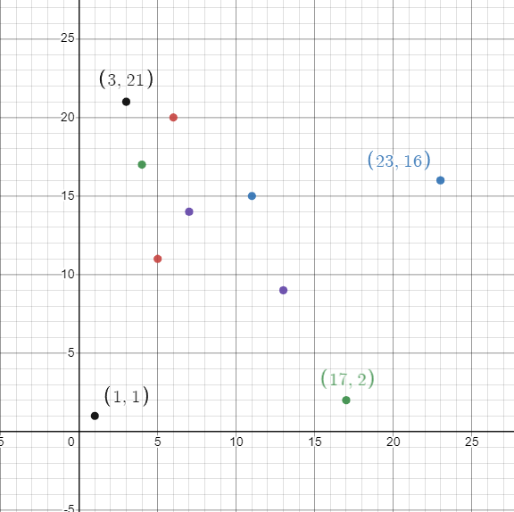
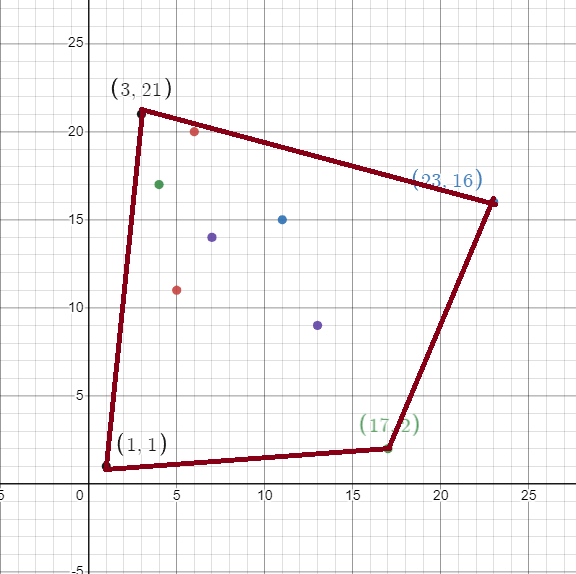

# Algorytmy2-Graham-Scan
Program ten jest moją implementacją algorytmu Grahama.  
Wykonany został w trakcie trzeciego semestru na potrzeby kursu *Algorytmy 2*.  
Działanie programu ogranicza się do znalezienia i wypisania w konsoli punktów tworzących powłoke wypukłą.  
Dodatkowo obliczany jest czas potrzebny na wykonanie poszczególnych elementów algorytmu.  
Program został oceniony na 5.
## Przykładowe działanie programu:  
Przykład na podstawie [pointsTest.txt](example-point-sets/pointsTest.txt).  
Program zwraca następujące wyniki:  
  

Sam zestaw punktów na wykresie prezentuje się w następujący sposób (Etykietami oznaczone zostały punkty tworzące powłoke wypukłą - według programu):  
  

Następnie możemy połączyć tworzące powłoke, aby jeszcze lepiej to zwizualizować:  

